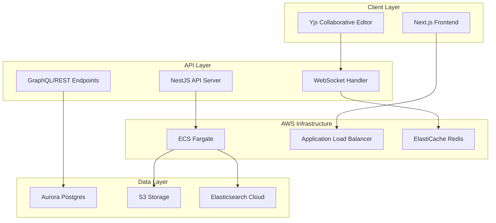

# Elastic Hackathon Proposal — Taggable Collaborative RAG Docs

## 1) Problem & Vision

**Problem:** Teams lose time hunting through scattered docs when they just want to *ask a question* and get trustworthy, permission‑aware answers. Existing RAG demos rarely respect fine‑grained access control, tags, or collaborative editing flows.

**Vision:** A user‑friendly, Google‑Docs‑like platform where people can:

* **Create / upload** docs and **add tags** (default tag auto‑applied if not provided).
* **Collaboratively edit** in real‑time (Yjs) while the system continuously prepares the content for search and RAG.
* **Ask the AI** with a single click: "Use my visible docs (filtered by my access + selected tags) as context."
* **Get answers with citations** that only reference documents the user can actually see.

## 2) What We’re Building (High‑Level)

A **taggable, permission‑aware RAG application** using **Elasticsearch** for hybrid retrieval (BM25 + vector), **AWS** for secure & scalable infra, and **Yjs** for low‑latency collaborative editing. The end‑user can attach documents to prompts instantly through a clean UX and per‑prompt tag filters.

## 3) Key Requirements

* **Usability:** One‑click “Attach docs to prompt” and quick tag selection; sensible default tag.
* **Security:** Document‑level visibility; search results must be a subset of user‑visible docs.
* **Collaboration:** Real‑time editing (CRDT/Yjs) without conflicts; durable snapshots.
* **Search Quality:** Hybrid retrieval (sparse + dense) with tag filters and access filters.
* **Scalability:** Handle bursty collaboration traffic and many concurrent queries.

## 4) Architecture Overview

### Why Subnets (AWS context)

* **Placement & isolation:** App servers in **private subnets**, internet egress via **NAT**; public ALB in public subnets.
* **Routing & security:** Per‑subnet route tables and NACLs; security groups keep Elasticsearch and DB private.

## 5) Data Model (Core Tables / Indices)

**Document** (Aurora Postgres)

* `id`, `owner_id`, `org_id`, `acl` (array of user\_ids/roles), `visibility` (private/shared/org/public),
* `tags` (array), `ydoc_id`, `current_version_id`, timestamps.

**Version Snapshot** (Aurora + S3)

* `id`, `doc_id`, `snapshot_s3_uri`, `text_hash`, `indexed_at`, `index_status`.

**ES Index: `doc_chunks`**

* `doc_id`, `chunk_id`, `content` (text), `tags` (keyword),
* `acl` fields: `owner_id`, `org_id`, `allowed_user_ids` (keyword), `visibility` (keyword),
* `dense_vector` (for ANN), standard text fields for BM25, and optional **ELSER** features.

## 6) Permission Model & Search Enforcement

* **Write‑time:** Every chunk inherits the document’s ACL/tag metadata.
* **Query‑time:** All retrievals include a **must** filter on ACL:

  * `(owner_id == userId) OR (org_id == userOrg AND visibility in ['org','public']) OR (allowed_user_ids contains userId) OR (visibility == 'public')`.
* **Tag filter:** `tags: (<selected tags> OR 'default')`.
* **Implementation options:**

  1. Application‑enforced filters on every ES query (safest + simplest in hackathon).
  2. **Filtered aliases** per user/org for defense‑in‑depth (stretch goal).
  3. (If available in plan) **Document‑level security** features in Elastic.

## 7) Indexing & Retrieval Pipeline

**Ingestion/Update**

1. Upload or Yjs edit occurs.
2. Debounced **snapshot** to S3 (e.g., on idle or every N seconds/ops).
3. **Text extraction** (fast path for plain text/MD; Textract for PDF/images if needed).
4. **Chunking** (recursive splitter \~1–2k tokens with overlap).
5. **Embeddings** via a provider (e.g., Cohere, OpenAI, Bedrock Titan, or local BGE on GPU) → store as `dense_vector`.
6. Index into **Elasticsearch** with: content, tags, ACL, vectors.

**Query**

1. User sets **tags** (default applied if none selected) and types a prompt.
2. Backend issues **hybrid retrieval** to ES:

   * **kNN** on `dense_vector` (top‑k neighbors)
   * **BM25** query on `content` (boost exact/phrase matches)
   * **Filters**: ACL + tags.
3. (Optional) **Reranking** with a cross‑encoder.
4. Compose **context window** + citations and call LLM **answer synthesis**.
5. Return answer with **source snippets**.

## 8) Collaboration (Yjs) Flow

* **Transport:** `y-websocket` compatible server in ECS Fargate (Node/WS) behind NLB/ALB.
* **Awareness:** Redis for presence; per‑doc rooms.
* **Durability:**

  * Append‑only **update log** (Redis Stream / Kinesis / Kafka) per `ydoc_id`.
  * Periodic **snapshots** of Yjs state to S3 (binary or text) → used for fast load and reindex triggers.
* **Backpressure & Congestion:**

  * Rate‑limit per connection; shard rooms by `doc_id` hash.
  * Debounce snapshot/indexing to avoid storm after bursts.
  * Horizontal auto‑scaling on CPU/mem/connection count.

## 9) AWS Components (baseline)

* **VPC** with public/private **subnets** across ≥2 AZs; IGW + NAT Gateways.
* **ALB/NLB**: HTTP for API, WS for Yjs.
* **ECS Fargate** (or EKS): NestJS API, y‑websocket, background workers.
* **Aurora Postgres**: metadata, ACL, audit logs.
* **ElastiCache Redis**: presence, queues, rate limits.
* **S3**: raw uploads, Yjs snapshots, extracted text.
* **Elastic Cloud on AWS (ESS)**: Elasticsearch + Kibana for vector/hybrid search.
* **Cognito**: auth (OIDC/JWT) + user pools and groups/roles.
* **CDK**: IaC constructs for VPC, subnets, services, SGs, IAM.

> **DynamoDB?** Possible for hot metadata/counters; but Aurora fits relational ACLs and complex queries. If DynamoDB is preferred, we’d denormalize ACLs and still index all ACL metadata into ES.

## 10) Frontend UX (Next.js)

* **Doc List:** create/upload, quick‑tagging (autocomplete); default tag auto‑applied.
* **Editor:** Yjs collaborative editor; tag chips; visibility switch (private/shared/org/public).
* **Prompt Panel:** tag selector (default on), “Attach Visible Docs” toggle; show which docs were used.
* **Answer View:** citations with inline highlights; “open doc at span” deep‑links.

## 11) Dev Experience

* **Monorepo:** `pnpm` workspaces with `apps/api (NestJS)`, `apps/web (Next.js)`, `packages/shared`.
* **CDK Stacks:** `NetworkStack` (VPC, subnets, NAT), `DataStack` (Aurora, Redis, S3), `SearchStack` (ESS endpoint & peering/VPC access), `AppStack` (ECS services, ALB/NLB), `AuthStack` (Cognito), `ObservabilityStack` (CloudWatch, OpenTelemetry).
* **Local:** docker‑compose (Postgres, Redis, ES) + seeded data.

## 12) Retrieval Quality Details

* **Indexing:** `content` (text), `content_ngram` (edge n‑grams for partial typing), `tags` (keyword), `visibility`/`acl` (keyword), `owner_id`, `org_id`, `allowed_user_ids`.
* **Vectors:** 768–1024 dims (model‑dependent), `hnsw` or `ivf` k‑NN.
* **Hybrid Query:** `dis_max` or `RRF` over (kNN, BM25), plus filter clauses; **tag boost** when user selected tags.
* **Rerank (optional):** small cross‑encoder for top‑50 hits.

## 13) Security & Privacy

* **AuthN:** Cognito JWT; short‑lived **ES API key** stored server‑side only.
* **AuthZ:** ABAC at app layer; filters on every ES query; audit every query w/ userId and docIds returned.
* **Network:** ES and DB private endpoints; no public SG ingress.
* **At rest:** S3/SSE, Aurora TDE, ES encryption. In transit: TLS.

## 14) Scaling & Resilience

* **Workers** auto‑scale based on indexing queue depth.
* **Multi‑AZ** Aurora; snapshots to S3.
* **ES:** multi‑node with shard/replica strategy; ILM for old chunks.
* **Yjs:** room sharding; sticky sessions or doc‑affinity through routing.

## 15) Milestones (Hackathon‑friendly)

1. **MVP (Day 1–2):**

   * Upload + tagging (default tag), create doc, Yjs collaboration, snapshots to S3.
   * ES index with ACL + tag metadata; basic hybrid retrieval; LLM answer synthesis.
2. **Polish (Day 3–4):**

   * Prompt panel UX, citations, tag‑boosting, per‑prompt tag picker.
   * Rate‑limits, simple backpressure, autoscaling policies.
3. **Stretch (Day 5–6):**

   * Filtered aliases/doc‑level security, cross‑encoder reranking, Textract for PDFs.
   * Kibana dashboards for search quality and ops.

## 17) Risks & Mitigations

* **Index surge during collab bursts:** debounce + bulk indexing; bounded queues.
* **Embedding cost/latency:** batch + cache; ELSER fallback for no‑embedding mode.
* **ACL drift:** index‑time inheritance + periodic reconciliation job.

## 18) Why Elastic?

* **First‑class hybrid search** (BM25 + vector/k‑NN) with production‑grade tooling.
* **ELSER** for zero‑embedding modes, **Kibana** for observability and search analytics.
* **Query‑time filtering** and sharding controls that fit ACL + tag use cases.

## 19) Demo Script

1. Create a doc → edit collaboratively → tags auto‑suggest; default tag applied.
2. Upload a PDF → auto‑extracted, chunked, embedded, indexed.
3. Open Prompt Panel → pick tags (or keep default) → “Ask”.
4. AI answers with citations; clicking a citation deep‑links to the exact doc span.

---

**Outcome:** A developer‑friendly, production‑minded RAG platform that lets users attach the *right* documents to AI prompts instantly—via tags and permissions—backed by Elastic’s hybrid search and robust AWS infrastructure.
